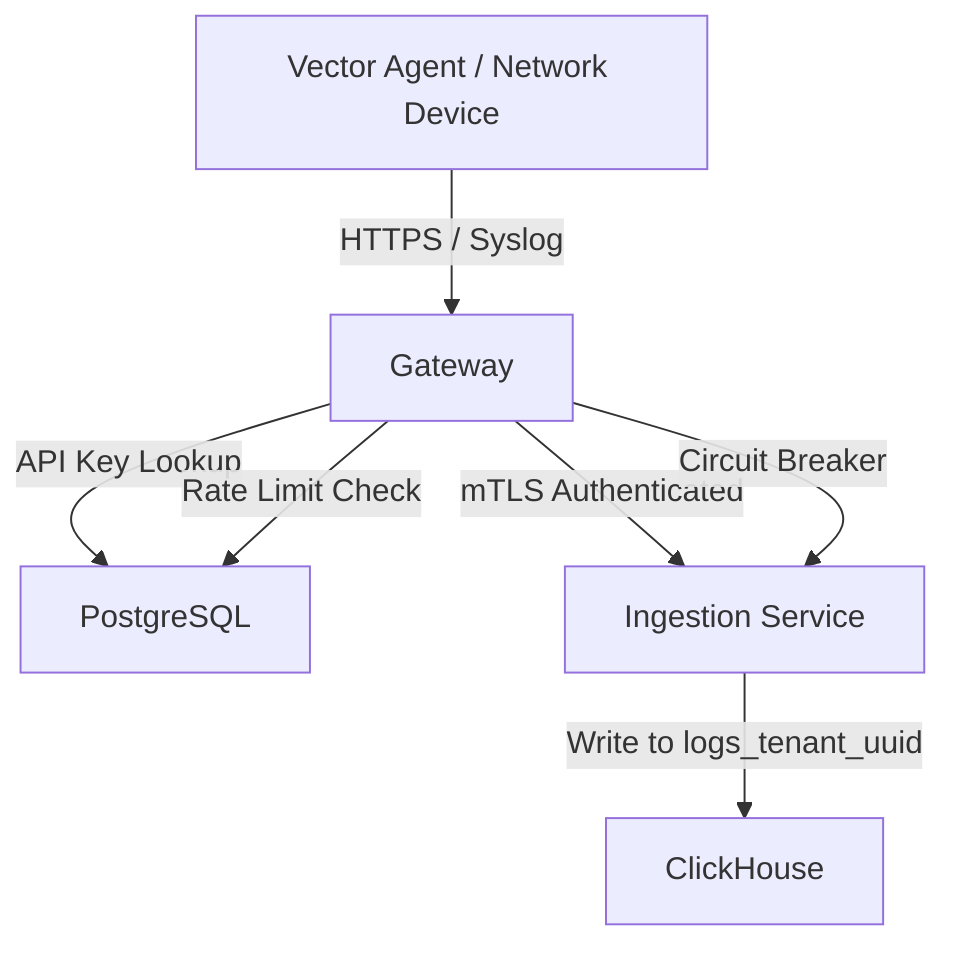

## ADDED Requirements

### Requirement: Gateway Deployment Architecture
The system SHALL deploy separate external and internal gateways to isolate internet-facing and corporate network log ingestion.

#### Scenario: External gateway deployment (DMZ)
- **WHEN** Docker Compose starts
- **THEN** the system deploys external-gateway container in dmz-network (172.20.0.0/24)
- **AND** exposes ports 443 (HTTPS), 514 (UDP/TCP syslog), 6514 (TLS syslog) on host
- **AND** maps host 0.0.0.0:443 → external-gateway:443

#### Scenario: Internal gateway deployment
- **WHEN** Docker Compose starts
- **THEN** the system deploys internal-gateway container in internal-network (172.21.0.0/24)
- **AND** exposes port 443 on host (mapped to 8443 to avoid conflict)
- **AND** maps host 0.0.0.0:8443 → internal-gateway:443

#### Scenario: Gateway to ingestion service mTLS
- **WHEN** gateway forwards logs to ingestion-service
- **THEN** the system establishes mTLS connection (mutual certificate authentication)
- **AND** both gateway and ingestion-service present certificates signed by O.A.S.I.S. CA
- **AND** validates certificate chain before accepting connection

### Requirement: API Key Authentication
The system SHALL authenticate all ingestion requests using tenant-specific API keys.

#### Scenario: API key extraction from request
- **WHEN** Vector agent sends POST /ingest with header "X-API-Key: oasis_pk_abc123..."
- **THEN** the gateway extracts API key from header
- **AND** queries PostgreSQL api_keys table for bcrypt hash match
- **AND** retrieves associated tenant_id

#### Scenario: Valid API key authentication
- **WHEN** API key matches active tenant in database
- **THEN** the gateway allows request to proceed
- **AND** includes tenant_id in forwarded request to ingestion-service
- **AND** logs successful auth (tenant_id, source_ip, timestamp)

#### Scenario: Missing API key
- **WHEN** request has no X-API-Key header
- **THEN** the gateway returns HTTP 401 Unauthorized
- **AND** response body: {"error": "Missing API key", "code": "MISSING_API_KEY"}
- **AND** logs failed auth attempt with source IP

#### Scenario: Invalid API key
- **WHEN** API key does not match any tenant
- **THEN** the gateway returns HTTP 401 Unauthorized
- **AND** response body: {"error": "Invalid API key", "code": "INVALID_API_KEY"}
- **AND** logs failed auth attempt with partial key (first 8 chars)

#### Scenario: Inactive tenant
- **WHEN** API key belongs to tenant with is_active=false
- **THEN** the gateway returns HTTP 403 Forbidden
- **AND** response body: {"error": "Tenant account is disabled", "code": "TENANT_DISABLED"}
- **AND** logs disabled tenant access attempt

#### Scenario: Database connection failure
- **WHEN** gateway cannot connect to PostgreSQL for API key validation
- **THEN** the gateway returns HTTP 503 Service Unavailable
- **AND** retries connection with exponential backoff (3 attempts)
- **AND** logs database connection error

### Requirement: Per-Tenant Rate Limiting
The system SHALL enforce configurable rate limits per tenant to prevent ingestion abuse.

#### Scenario: Rate limit enforcement
- **WHEN** tenant "Acme Corp" has rate limit of 10,000 EPS (events per second)
- **AND** sends 11,000 events in 1 second
- **THEN** the gateway accepts first 10,000 events
- **AND** returns HTTP 429 Too Many Requests for remaining 1,000 events
- **AND** includes Retry-After: 1 header (wait 1 second)

#### Scenario: Rate limit token bucket algorithm
- **WHEN** gateway tracks rate limit for a tenant
- **THEN** the system uses token bucket algorithm (refills at configured EPS)
- **AND** allows burst up to 2x configured rate for 1 second
- **AND** rejects excess requests beyond burst capacity

#### Scenario: Rate limit exceeded response
- **WHEN** tenant exceeds rate limit
- **THEN** the gateway returns HTTP 429 with body: {"error": "Rate limit exceeded", "code": "RATE_LIMIT_EXCEEDED", "retry_after": 1, "limit": 10000}
- **AND** increments Prometheus metric: rate_limit_exceeded{tenant="acme"}

#### Scenario: Rate limit configuration reload
- **WHEN** admin updates tenant rate limit via UI (e.g., 10k → 50k EPS)
- **THEN** the gateway polls PostgreSQL every 60 seconds for config changes
- **AND** applies new rate limit within 60 seconds without restart

### Requirement: Input Validation
The system SHALL validate all ingestion requests to protect backend services from malformed or malicious input.

#### Scenario: Payload size validation
- **WHEN** request body exceeds 10MB
- **THEN** the gateway returns HTTP 413 Payload Too Large
- **AND** response body: {"error": "Payload too large", "code": "PAYLOAD_TOO_LARGE", "max_size_mb": 10}
- **AND** does not forward request to ingestion-service

#### Scenario: JSON schema validation
- **WHEN** request Content-Type is application/json
- **AND** body is not valid JSON
- **THEN** the gateway returns HTTP 400 Bad Request
- **AND** response body: {"error": "Invalid JSON", "code": "INVALID_JSON"}

#### Scenario: Required field validation
- **WHEN** request body missing required fields (e.g., "timestamp", "message")
- **THEN** the gateway returns HTTP 400 Bad Request
- **AND** response body: {"error": "Missing required field: timestamp", "code": "MISSING_FIELD", "field": "timestamp"}

#### Scenario: Batch size limit
- **WHEN** batch ingestion request contains array with >10,000 events
- **THEN** the gateway returns HTTP 400 Bad Request
- **AND** response body: {"error": "Batch size exceeds maximum", "code": "BATCH_TOO_LARGE", "max_batch_size": 10000, "received": 15000}

#### Scenario: SQL injection prevention
- **WHEN** request contains suspicious patterns (e.g., "' OR 1=1", "DROP TABLE")
- **THEN** the gateway sanitizes input (escapes special characters)
- **AND** logs suspicious input for security review
- **AND** forwards sanitized version to ingestion-service

### Requirement: Syslog Protocol Support
The system SHALL accept traditional syslog messages (RFC 3164/5424) from network devices.

#### Scenario: UDP syslog reception (port 514)
- **WHEN** firewall sends syslog message via UDP to external-gateway:514
- **THEN** the gateway receives datagram and parses RFC 3164/5424 format
- **AND** converts to JSON format with tenant_id "internal" (default for syslog)
- **AND** forwards to ingestion-service via mTLS

#### Scenario: TCP syslog reception (port 514)
- **WHEN** switch sends syslog message via TCP to internal-gateway:514
- **THEN** the gateway maintains TCP connection with keep-alive
- **AND** handles multiple messages per connection (newline-delimited)
- **AND** gracefully handles connection close and reconnect

#### Scenario: TLS syslog reception (port 6514)
- **WHEN** router sends syslog message via TLS to external-gateway:6514
- **THEN** the gateway terminates TLS connection
- **AND** optionally validates client certificate (mTLS for syslog)
- **AND** parses and forwards message

#### Scenario: Syslog parsing failure
- **WHEN** syslog message is malformed (invalid priority, missing fields)
- **THEN** the gateway logs parsing error
- **AND** stores raw syslog message in error queue (Phase 2)
- **AND** does not drop message (best effort forwarding)

### Requirement: Health Check Endpoints
The system SHALL provide health check endpoints for load balancer and monitoring integration.

#### Scenario: Liveness probe (/health)
- **WHEN** Kubernetes or load balancer sends GET /health
- **THEN** the gateway returns HTTP 200 OK if process is running
- **AND** response body: {"status": "healthy", "timestamp": "2024-01-08T12:00:00Z"}
- **AND** does not check downstream dependencies (fast response)

#### Scenario: Readiness probe (/ready)
- **WHEN** Kubernetes sends GET /ready
- **THEN** the gateway returns HTTP 200 OK if ready to accept traffic
- **AND** checks PostgreSQL connection (API key validation dependency)
- **AND** checks ingestion-service reachability via mTLS connection
- **AND** returns HTTP 503 Service Unavailable if any dependency is down
- **AND** response body: {"status": "ready", "dependencies": {"postgres": "ok", "ingestion": "ok"}}

#### Scenario: Readiness failure
- **WHEN** gateway cannot connect to PostgreSQL
- **THEN** GET /ready returns HTTP 503
- **AND** response body: {"status": "not_ready", "dependencies": {"postgres": "error", "ingestion": "ok"}, "message": "Database connection failed"}
- **AND** load balancer removes gateway from rotation

### Requirement: Request Logging and Audit Trail
The system SHALL log all ingestion requests for compliance and troubleshooting.

#### Scenario: Successful request logging
- **WHEN** gateway successfully forwards request to ingestion-service
- **THEN** the system logs (structured JSON): timestamp, tenant_id, source_ip, request_method, request_path, status_code, response_time_ms, event_count
- **AND** writes to stdout (captured by Docker logs)

#### Scenario: Failed request logging
- **WHEN** gateway rejects request (auth failure, rate limit, validation error)
- **THEN** the system logs: timestamp, source_ip, error_code, error_message, partial_api_key (first 8 chars)
- **AND** increments Prometheus error metric: gateway_errors_total{code="INVALID_API_KEY"}

#### Scenario: Audit log retention
- **WHEN** logs are written to stdout
- **THEN** Docker captures logs with JSON log driver
- **AND** logs are rotated daily (max 7 days retention by default)
- **AND** can be forwarded to external log aggregator (e.g., another O.A.S.I.S. instance)

### Requirement: Circuit Breaker for Ingestion Service
The system SHALL implement circuit breaker pattern to prevent cascading failures when ingestion-service is unavailable.

#### Scenario: Ingestion service healthy
- **WHEN** ingestion-service responds successfully to requests
- **THEN** circuit breaker is in "closed" state (requests allowed)
- **AND** gateway forwards all authenticated requests

#### Scenario: Ingestion service failure threshold
- **WHEN** 5 consecutive requests to ingestion-service fail (timeout or 500 error)
- **THEN** circuit breaker trips to "open" state
- **AND** gateway stops forwarding requests for 30 seconds (cooldown)
- **AND** returns HTTP 503 Service Unavailable to clients
- **AND** response body: {"error": "Ingestion service unavailable", "code": "INGESTION_DOWN", "retry_after": 30}

#### Scenario: Circuit breaker half-open state
- **WHEN** 30 seconds have elapsed in "open" state
- **THEN** circuit breaker enters "half-open" state
- **AND** allows single probe request to ingestion-service
- **AND** closes circuit if probe succeeds (resume normal operation)
- **AND** reopens circuit if probe fails (wait another 30 seconds)

### Requirement: Scalability and Load Balancing
The system SHALL support horizontal scaling with multiple gateway instances behind a load balancer (architecture documented for Phase 2, single instance for Phase 1).

#### Scenario: Multiple gateway instances (Phase 2)
- **WHEN** production deployment uses load balancer (e.g., HAProxy, Nginx, AWS ALB)
- **THEN** load balancer distributes traffic across multiple gateway instances
- **AND** uses round-robin or least-connections algorithm
- **AND** performs health checks via /ready endpoint

#### Scenario: Session affinity (Phase 2)
- **WHEN** Vector agent maintains persistent connection to gateway
- **THEN** load balancer uses source IP affinity to route to same gateway instance
- **AND** reduces connection churn and improves throughput

#### Scenario: Stateless gateway design
- **WHEN** gateway processes request
- **THEN** all required state (API keys, rate limits) is stored in PostgreSQL or Redis
- **AND** no local state prevents horizontal scaling
- **AND** gateway instance can be added/removed without data loss

## MODIFIED Requirements

None (this is a new capability specification)

## REMOVED Requirements

None

## Dependency Map

## Open Questions

1. **Rate limit storage**: Use PostgreSQL (current) or Redis for faster lookups?
   - **Recommendation**: PostgreSQL for Phase 1 (simpler), Redis for Phase 2 (sub-millisecond lookups)

2. **Load balancer selection**: Nginx, HAProxy, or cloud-native (AWS ALB, GCP LB)?
   - **Recommendation**: Document all options, recommend Nginx for self-hosted, cloud LB for cloud deployments

3. **Syslog default tenant**: Always use "Internal" tenant or allow configuration?
   - **Recommendation**: Configurable via environment variable (SYSLOG_DEFAULT_TENANT), defaults to "Internal"
