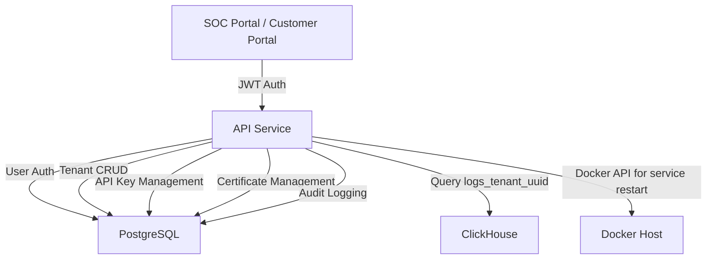

## ADDED Requirements

### Requirement: User Authentication with JWT
The system SHALL authenticate users using username/password + TOTP and issue JWT tokens with tenant claims.

#### Scenario: Login with valid credentials
- **WHEN** user submits POST /auth/login with {"username": "admin", "password": "SecurePass123!", "totp": "123456"}
- **THEN** the system validates username/password against PostgreSQL users table (bcrypt hash)
- **AND** validates TOTP code against user's stored secret (time-based, 30s window)
- **AND** issues JWT with claims: {user_id, tenant_id, role, exp: 1h}
- **AND** returns {token, expires_at, user: {username, role}}

#### Scenario: Login with invalid credentials
- **WHEN** user submits incorrect password
- **THEN** the system returns HTTP 401 Unauthorized
- **AND** response body: {"error": "Invalid credentials", "code": "INVALID_CREDENTIALS"}
- **AND** logs failed login attempt to audit_logs (user, IP, timestamp)
- **AND** increments failed login counter (rate limit after 5 failures)

#### Scenario: Login with invalid TOTP
- **WHEN** user submits correct password but wrong TOTP code
- **THEN** the system returns HTTP 401 Unauthorized
- **AND** response body: {"error": "Invalid TOTP code", "code": "INVALID_TOTP"}
- **AND** logs failed TOTP attempt

#### Scenario: Brute force protection
- **WHEN** user has 5 failed login attempts within 15 minutes
- **THEN** the system locks account for 15 minutes
- **AND** returns HTTP 429 Too Many Requests
- **AND** response body: {"error": "Too many failed attempts", "code": "RATE_LIMITED", "retry_after": 900}

#### Scenario: JWT token validation
- **WHEN** user makes authenticated request with Authorization: Bearer <token>
- **THEN** the system validates JWT signature with secret key
- **AND** checks expiration (reject if expired)
- **AND** extracts user_id, tenant_id, role from claims for request context

#### Scenario: JWT token refresh
- **WHEN** user sends POST /auth/refresh with valid JWT (within 5 minutes of expiration)
- **THEN** the system issues new JWT with extended expiration (1h from now)
- **AND** returns {token, expires_at}

### Requirement: Re-authentication for Sensitive Operations
The system SHALL require password + TOTP re-entry for sensitive configuration changes.

#### Scenario: Re-authentication endpoint
- **WHEN** user sends POST /auth/reauth with {"password": "SecurePass123!", "totp": "123456"}
- **THEN** the system validates credentials against current user (from JWT)
- **AND** issues short-lived token (5 minutes) with "elevated" claim
- **AND** returns {elevated_token, expires_at: 5min}

#### Scenario: Sensitive operation with elevated token
- **WHEN** user regenerates certificate with elevated token
- **THEN** the system validates "elevated" claim in JWT
- **AND** allows operation if claim present and not expired
- **AND** rejects with HTTP 403 Forbidden if no elevated claim

#### Scenario: Elevated token expiration
- **WHEN** elevated token expires after 5 minutes
- **THEN** subsequent sensitive operations return HTTP 401 Unauthorized
- **AND** response body: {"error": "Re-authentication required", "code": "REAUTH_REQUIRED"}
- **AND** frontend prompts user for re-authentication modal

### Requirement: Tenant CRUD API
The system SHALL provide REST API for managing tenants (super_admin only).

#### Scenario: Create tenant
- **WHEN** super_admin sends POST /tenants with {"name": "Acme Corp", "retention_days": 90, "rate_limit_eps": 10000}
- **THEN** the system validates name is unique
- **AND** generates UUID for tenant
- **AND** generates API key (oasis_pk_<random>)
- **AND** stores tenant in PostgreSQL with bcrypt hash of API key
- **AND** creates ClickHouse table logs_{tenant_uuid}
- **AND** logs creation to audit_logs
- **AND** returns {id, name, api_key: "<full_key_shown_once>", retention_days, rate_limit_eps}

#### Scenario: List tenants
- **WHEN** super_admin sends GET /tenants
- **THEN** the system returns array of tenants with fields: id, name, created_at, retention_days, rate_limit_eps, is_active, api_key_prefix
- **AND** paginates results (default 50 per page)

#### Scenario: Get tenant by ID
- **WHEN** super_admin sends GET /tenants/{id}
- **THEN** the system returns tenant details with api_key_prefix (not full key)
- **AND** includes statistics: total_events_ingested, disk_usage_bytes

#### Scenario: Update tenant
- **WHEN** super_admin sends PUT /tenants/{id} with {"retention_days": 180, "rate_limit_eps": 50000}
- **THEN** the system updates PostgreSQL tenants table
- **AND** alters ClickHouse table TTL if retention_days changed
- **AND** logs update to audit_logs with old and new values
- **AND** returns updated tenant

#### Scenario: Delete tenant
- **WHEN** super_admin sends DELETE /tenants/{id}
- **THEN** the system soft-deletes tenant (sets is_active=false) or hard-deletes based on query param
- **AND** drops ClickHouse table logs_{tenant_uuid} if hard delete
- **AND** logs deletion to audit_logs
- **AND** returns HTTP 204 No Content

#### Scenario: Unauthorized tenant access
- **WHEN** user with role "internal_soc" attempts POST /tenants
- **THEN** the system returns HTTP 403 Forbidden
- **AND** response body: {"error": "Insufficient permissions", "code": "FORBIDDEN", "required_role": "super_admin"}

### Requirement: API Key Management API
The system SHALL provide endpoints for regenerating tenant API keys.

#### Scenario: Regenerate API key
- **WHEN** super_admin sends POST /tenants/{id}/apikey/regenerate with elevated token
- **THEN** the system generates new API key (oasis_pk_<random>)
- **AND** updates PostgreSQL api_keys table with new bcrypt hash
- **AND** invalidates old API key immediately
- **AND** logs regeneration to audit_logs
- **AND** returns {api_key: "<full_new_key_shown_once>", api_key_prefix: "oasis_pk_abc12345"}

#### Scenario: Regenerate without elevated token
- **WHEN** user attempts regeneration without re-authentication
- **THEN** the system returns HTTP 401 Unauthorized
- **AND** response body: {"error": "Re-authentication required", "code": "REAUTH_REQUIRED"}

### Requirement: Log Query API with Tenant Isolation
The system SHALL provide endpoints for querying logs with strict tenant isolation.

#### Scenario: Query logs for user's tenant
- **WHEN** user sends GET /logs?start=2024-01-07T00:00:00Z&end=2024-01-08T00:00:00Z&severity=error
- **THEN** the system extracts tenant_id from JWT
- **AND** queries ClickHouse table logs_{tenant_uuid} only
- **AND** applies filters: timestamp range, severity
- **AND** limits results to 10,000 rows
- **AND** returns {logs: [...], count: 150, has_more: false}

#### Scenario: Pagination
- **WHEN** user sends GET /logs?offset=100&limit=100
- **THEN** the system returns logs 100-199
- **AND** includes pagination metadata: {offset: 100, limit: 100, total: 1500}

#### Scenario: Full-text search
- **WHEN** user sends GET /logs?q=192.168.1.1
- **THEN** the system searches across message, source_ip, dest_ip, user_name fields
- **AND** uses ClickHouse `LIKE` or `multiSearchAny` for pattern matching

#### Scenario: Cross-tenant query prevention
- **WHEN** malicious user modifies JWT tenant_id claim (signature invalid)
- **THEN** JWT validation fails (signature mismatch)
- **AND** system returns HTTP 401 Unauthorized

#### Scenario: SQL injection prevention
- **WHEN** user sends GET /logs?q=' OR 1=1 --
- **THEN** the system uses parameterized queries (not string concatenation)
- **AND** escapes special characters
- **AND** logs suspicious query to audit_logs for review

### Requirement: Certificate Management API
The system SHALL provide endpoints for viewing and regenerating TLS certificates.

#### Scenario: List certificates
- **WHEN** super_admin sends GET /certificates
- **THEN** the system returns array from PostgreSQL certificates table: id, name, expires_at, status (valid/expiring/expired)
- **AND** calculates status: valid (>30 days), expiring (<30 days), expired (<0 days)

#### Scenario: Get certificate details
- **WHEN** super_admin sends GET /certificates/{name}
- **THEN** the system returns certificate PEM, issuer, subject, serial number, expires_at
- **AND** does NOT return private_key_pem (security)

#### Scenario: Download certificate
- **WHEN** super_admin sends GET /certificates/{name}/download
- **THEN** the system returns certificate PEM as file download (Content-Disposition: attachment)
- **AND** logs download to audit_logs

#### Scenario: Regenerate certificate
- **WHEN** super_admin sends POST /certificates/{name}/regenerate with elevated token
- **THEN** the system generates new self-signed certificate with 365-day expiration
- **AND** updates PostgreSQL certificates table
- **AND** calls Docker API to restart affected containers (e.g., external-gateway)
- **AND** logs regeneration to audit_logs
- **AND** returns {name, expires_at, status: "valid"}

### Requirement: Audit Logging Middleware
The system SHALL automatically log all API requests and sensitive operations.

#### Scenario: Request logging
- **WHEN** any API request is processed
- **THEN** the system logs to PostgreSQL audit_logs: timestamp, user_id, tenant_id, action (HTTP method + path), ip_address, user_agent, status_code

#### Scenario: CRUD operation logging
- **WHEN** user creates, updates, or deletes a resource (tenant, user, certificate)
- **THEN** the system logs to audit_logs with action (e.g., "tenant.create", "certificate.regenerate")
- **AND** includes metadata JSONB with old and new values (for updates)

#### Scenario: Failed operation logging
- **WHEN** API request fails (auth failure, validation error, server error)
- **THEN** the system logs to audit_logs with error_code and error_message

### Requirement: RBAC Enforcement
The system SHALL enforce role-based access control for all API endpoints.

#### Scenario: Super admin access
- **WHEN** user with role "super_admin" accesses any endpoint
- **THEN** the system allows access (full permissions)

#### Scenario: Internal SOC access
- **WHEN** user with role "internal_soc" accesses GET /logs
- **THEN** the system allows access if tenant_id matches "Internal" tenant
- **AND** denies access to /tenants, /certificates, /users

#### Scenario: SOC operator access
- **WHEN** user with role "soc_operator" accesses GET /logs
- **THEN** the system allows read-only access (GET only)
- **AND** denies POST, PUT, DELETE methods
- **AND** returns HTTP 403 Forbidden with required_role in response

#### Scenario: Tenant user access (Phase 2)
- **WHEN** user with role "tenant_user" accesses GET /logs
- **THEN** the system allows access only to their tenant's logs
- **AND** denies access to all admin endpoints

### Requirement: Health Check and Metrics
The system SHALL provide health check and metrics endpoints for monitoring.

#### Scenario: Health check
- **WHEN** load balancer sends GET /health
- **THEN** the system returns HTTP 200 OK with {"status": "healthy"}

#### Scenario: Readiness check
- **WHEN** Kubernetes sends GET /ready
- **THEN** the system checks PostgreSQL and ClickHouse connectivity
- **AND** returns HTTP 200 OK if all dependencies reachable
- **AND** returns HTTP 503 Service Unavailable if any dependency down

#### Scenario: Metrics endpoint
- **WHEN** Prometheus scrapes GET /metrics
- **THEN** the system exposes metrics in Prometheus format:
  - api_requests_total{method, endpoint, status}
  - api_request_duration_seconds{method, endpoint}
  - database_query_duration_seconds{database}
  - active_users_count

### Requirement: Rate Limiting
The system SHALL enforce rate limits on API endpoints to prevent abuse.

#### Scenario: Per-user rate limit
- **WHEN** user makes more than 100 requests per minute to /logs
- **THEN** the system returns HTTP 429 Too Many Requests
- **AND** response body: {"error": "Rate limit exceeded", "code": "RATE_LIMITED", "retry_after": 60}

#### Scenario: Per-IP rate limit (unauthenticated endpoints)
- **WHEN** IP address makes more than 10 requests per minute to /auth/login
- **THEN** the system returns HTTP 429 Too Many Requests
- **AND** logs potential brute force attempt

## MODIFIED Requirements

None (this is a new capability specification)

## REMOVED Requirements

None

## Dependency Map

## Open Questions

1. **JWT secret rotation**: Manual rotation or automated?
   - **Recommendation**: Manual for Phase 1 (stored in environment variable), automated rotation in Phase 2

2. **Session blacklist**: Store revoked tokens in PostgreSQL or Redis?
   - **Recommendation**: Not required for Phase 1 (short 1h expiration), Redis for Phase 2 if needed

3. **API rate limit storage**: In-memory (per API service instance) or Redis (shared)?
   - **Recommendation**: In-memory for Phase 1 (simpler), Redis for Phase 2 (accurate across instances)
