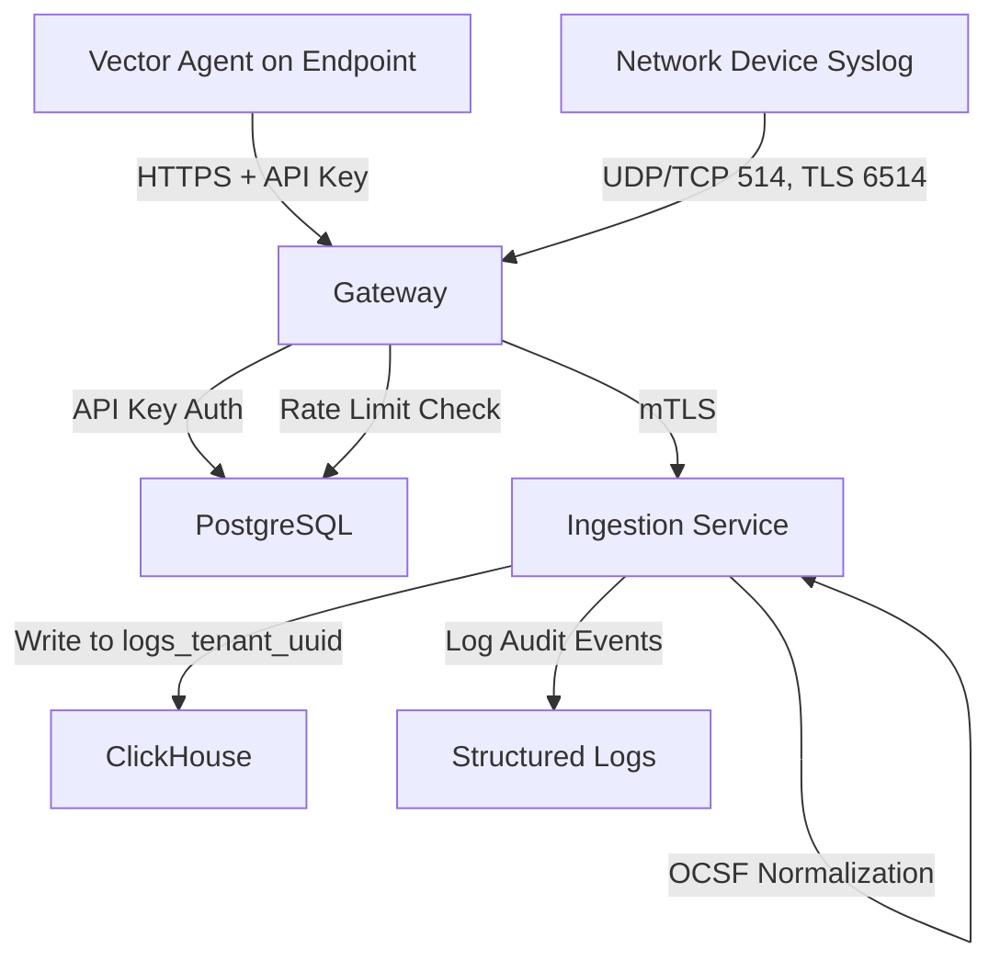

## ADDED Requirements

### Requirement: Gateway API Key Authentication
The system SHALL authenticate all ingestion requests using tenant-specific API keys before forwarding to backend services.

#### Scenario: Successful API key authentication
- **WHEN** a Vector agent sends a POST request to gateway with valid API key header
- **THEN** the gateway validates the key against PostgreSQL api_keys table
- **AND** extracts the tenant_id associated with the API key
- **AND** forwards the request to ingestion-service with tenant_id metadata

#### Scenario: Missing API key
- **WHEN** a request is sent without an API key header
- **THEN** the gateway returns HTTP 401 Unauthorized
- **AND** includes error message "Missing API key"
- **AND** logs the failed authentication attempt

#### Scenario: Invalid API key
- **WHEN** a request is sent with an invalid or expired API key
- **THEN** the gateway returns HTTP 401 Unauthorized
- **AND** includes error message "Invalid API key"
- **AND** logs the failed authentication attempt with source IP

#### Scenario: Inactive tenant
- **WHEN** a request is sent with a valid API key for an inactive tenant
- **THEN** the gateway returns HTTP 403 Forbidden
- **AND** includes error message "Tenant account is disabled"

### Requirement: Gateway Rate Limiting
The system SHALL enforce per-tenant rate limits to prevent ingestion abuse and ensure fair resource allocation.

#### Scenario: Normal ingestion rate
- **WHEN** a tenant sends logs below their configured rate limit (e.g., 10,000 EPS)
- **THEN** all requests are forwarded to ingestion-service
- **AND** gateway returns HTTP 202 Accepted

#### Scenario: Rate limit exceeded
- **WHEN** a tenant exceeds their configured rate limit
- **THEN** the gateway returns HTTP 429 Too Many Requests
- **AND** includes Retry-After header with wait time in seconds
- **AND** drops excess logs (does not buffer indefinitely)
- **AND** increments rate_limit_exceeded metric for monitoring

#### Scenario: Rate limit configuration
- **WHEN** an admin updates a tenant's rate limit via UI
- **THEN** the gateway reloads configuration from PostgreSQL
- **AND** applies new rate limit within 60 seconds (configurable refresh interval)

### Requirement: Gateway Input Validation
The system SHALL validate all ingestion requests to protect backend services from malformed or malicious input.

#### Scenario: Payload size limit
- **WHEN** a request payload exceeds 10MB
- **THEN** the gateway returns HTTP 413 Payload Too Large
- **AND** does not forward the request to ingestion-service
- **AND** logs the rejection with tenant_id and payload size

#### Scenario: JSON schema validation
- **WHEN** a request contains invalid JSON or missing required fields
- **THEN** the gateway returns HTTP 400 Bad Request
- **AND** includes descriptive error message (e.g., "Missing field: timestamp")

#### Scenario: Batch size limit
- **WHEN** a batch ingestion request contains more than 10,000 events
- **THEN** the gateway returns HTTP 400 Bad Request
- **AND** includes error message "Batch size exceeds maximum of 10,000 events"

### Requirement: Gateway Syslog Support
The system SHALL accept traditional syslog messages (RFC 3164/5424) from network devices that cannot run Vector agent.

#### Scenario: UDP syslog reception
- **WHEN** a firewall sends a syslog message via UDP to port 514
- **THEN** the gateway receives and parses the message
- **AND** converts it to JSON format with tenant_id "internal" (default for syslog)
- **AND** forwards to ingestion-service

#### Scenario: TCP syslog reception
- **WHEN** a switch sends a syslog message via TCP to port 514
- **THEN** the gateway receives and parses the message
- **AND** handles TCP connection state (keep-alive, reconnect)

#### Scenario: TLS-encrypted syslog reception
- **WHEN** a router sends a syslog message via TLS to port 6514
- **THEN** the gateway terminates TLS connection
- **AND** validates client certificate (optional mTLS)
- **AND** parses and forwards the message

### Requirement: Gateway Health Checks
The system SHALL provide health check endpoints for load balancer and monitoring integration.

#### Scenario: Health check endpoint
- **WHEN** a load balancer sends GET request to `/health`
- **THEN** the gateway returns HTTP 200 OK if healthy
- **AND** returns HTTP 503 Service Unavailable if ingestion-service is unreachable

#### Scenario: Readiness check endpoint
- **WHEN** Kubernetes sends GET request to `/ready`
- **THEN** the gateway returns HTTP 200 OK if ready to accept traffic
- **AND** returns HTTP 503 if still loading configuration from PostgreSQL

### Requirement: Vector Agent Integration
The system SHALL support Vector agent as the primary log collection method for endpoints (Windows, Linux, macOS).

#### Scenario: Vector agent HTTP ingestion
- **WHEN** a Vector agent sends POST request to gateway with JSON logs
- **THEN** the gateway accepts logs in Vector's HTTP sink format
- **AND** validates API key from custom header (X-API-Key)
- **AND** forwards to ingestion-service after validation

#### Scenario: Vector agent configuration example
- **WHEN** an admin deploys Vector agent on Windows endpoint
- **THEN** the agent is configured with gateway URL and API key
- **AND** collects Windows Event Log (Security, System, Application)
- **AND** sends logs to external gateway over HTTPS

#### Scenario: Vector agent on Linux
- **WHEN** Vector agent is deployed on Linux server
- **THEN** the agent collects syslog and systemd journal logs
- **AND** applies local filtering (drop low-severity events)
- **AND** sends filtered logs to internal gateway

#### Scenario: Vector agent on macOS
- **WHEN** Vector agent is deployed on macOS workstation
- **THEN** the agent collects macOS Unified Log
- **AND** enriches logs with host metadata (hostname, OS version)
- **AND** sends to external gateway with API key authentication

### Requirement: Ingestion Service OCSF Normalization
The system SHALL normalize all ingested logs to the Open Cybersecurity Schema Framework (OCSF) standard before storage.

#### Scenario: Successful OCSF normalization
- **WHEN** ingestion-service receives a Windows Event Log (ID 4624 - Logon)
- **THEN** the system maps to OCSF category "IAM" and class "Authentication"
- **AND** extracts common fields (timestamp, user, source_ip, hostname)
- **AND** preserves original log in `raw_log` field
- **AND** writes to tenant-specific ClickHouse table (logs_{tenant_uuid})

#### Scenario: OCSF normalization for Linux syslog
- **WHEN** ingestion-service receives a Linux auth.log SSH login
- **THEN** the system maps to OCSF category "IAM" and class "Authentication"
- **AND** extracts user, source_ip, result (success/failure)

#### Scenario: OCSF normalization for firewall logs
- **WHEN** ingestion-service receives a firewall deny log
- **THEN** the system maps to OCSF category "Network Activity" and class "Network Activity"
- **AND** extracts source_ip, dest_ip, port, protocol, action (deny)

#### Scenario: Normalization failure fallback
- **WHEN** a log cannot be normalized to OCSF (unknown format)
- **THEN** the system stores the raw log with category "Unknown"
- **AND** class "Other"
- **AND** logs a warning for monitoring
- **AND** does NOT reject the ingestion (preserves data)

### Requirement: Ingestion Service Multi-Tenant Data Isolation
The system SHALL write logs to tenant-specific ClickHouse tables to enforce data isolation.

#### Scenario: New tenant table auto-creation
- **WHEN** ingestion-service receives logs for a new tenant (first ingestion)
- **THEN** the system creates a new ClickHouse table `logs_{tenant_uuid}`
- **AND** applies default retention policy (90 days TTL)
- **AND** creates partitions by month (toYYYYMM)

#### Scenario: Tenant-specific table write
- **WHEN** ingestion-service processes logs for tenant "Acme Corp" (UUID: 550e8400-...)
- **THEN** the system writes to ClickHouse table `logs_550e8400_e29b_41d4_a716_446655440000`
- **AND** never writes to other tenant tables (enforced at application layer)

#### Scenario: Per-tenant retention policy
- **WHEN** a tenant has custom retention policy (e.g., 180 days)
- **THEN** the system applies TTL `timestamp + INTERVAL 180 DAY` to that tenant's table
- **AND** ClickHouse automatically deletes expired data

### Requirement: Ingestion Service Batch Write Optimization
The system SHALL batch inserts to ClickHouse for optimal write performance.

#### Scenario: Batch insert by count
- **WHEN** the ingestion buffer reaches 1000 logs
- **THEN** the system performs a batch INSERT to ClickHouse
- **AND** confirms write success before clearing buffer

#### Scenario: Batch insert by time
- **WHEN** 5 seconds have elapsed since last batch insert
- **THEN** the system flushes all buffered logs to ClickHouse
- **AND** resets the timer

#### Scenario: Batch insert failure
- **WHEN** a batch INSERT to ClickHouse fails (connection error)
- **THEN** the system retries up to 3 times with exponential backoff
- **AND** logs the error with batch metadata (count, tenant_id)
- **AND** writes failed batch to dead-letter queue for manual review (Phase 2)

### Requirement: Ingestion Service Back-pressure Handling
The system SHALL handle ingestion bursts without data loss or service degradation.

#### Scenario: Normal ingestion load
- **WHEN** the ingestion rate is below 10,000 events per second
- **THEN** all logs are processed with p99 latency under 100ms
- **AND** memory usage stays within configured limits (1-2GB)

#### Scenario: Burst traffic handling
- **WHEN** the ingestion rate exceeds 10,000 events per second
- **THEN** the system buffers logs in memory up to 50MB per tenant
- **AND** returns HTTP 503 Service Unavailable to gateway if buffer is full
- **AND** gateway enforces rate limits to reduce load

#### Scenario: ClickHouse unavailable
- **WHEN** ClickHouse is unreachable (network or service failure)
- **THEN** ingestion-service returns HTTP 503 to gateway
- **AND** gateway returns HTTP 503 to Vector agents with Retry-After header
- **AND** Vector agents buffer logs locally and retry

### Requirement: Gateway mTLS to Ingestion Service
The system SHALL use mutual TLS for secure communication between gateway and ingestion-service.

#### Scenario: mTLS handshake
- **WHEN** gateway initiates connection to ingestion-service
- **THEN** both services present certificates signed by O.A.S.I.S. CA
- **AND** validate each other's certificates
- **AND** establish encrypted connection

#### Scenario: Invalid certificate rejection
- **WHEN** gateway presents an invalid or expired certificate
- **THEN** ingestion-service rejects the connection
- **AND** logs the rejection with gateway hostname and certificate details

### Requirement: Ingestion Audit Logging
The system SHALL log all ingestion activities for compliance and troubleshooting.

#### Scenario: Successful ingestion audit
- **WHEN** gateway successfully forwards logs to ingestion-service
- **THEN** ingestion-service logs: tenant_id, event_count, source_ip, timestamp
- **AND** writes to structured log file (JSON format)

#### Scenario: Failed ingestion audit
- **WHEN** ingestion fails (normalization error, database write failure)
- **THEN** ingestion-service logs: tenant_id, error_type, error_message, sample_log
- **AND** increments error metric for monitoring

## MODIFIED Requirements

None (this is a new capability specification)

## REMOVED Requirements

### Requirement: Syslog-ng Integration (REMOVED)
- **Reason**: Replaced with gateway architecture + Vector agent for better cross-platform support and flexibility
- **Migration**: Syslog support retained at gateway level for network devices, but syslog-ng container no longer required

## Dependency Map

## Open Questions

1. **Dead-letter queue implementation**: Use Redis, PostgreSQL, or file-based storage for failed ingestion batches?
   - **Recommendation**: File-based for Phase 1 (simplicity), Redis for Phase 2 (better observability)

2. **Gateway configuration reload**: Poll PostgreSQL every 60s or use PostgreSQL NOTIFY for real-time updates?
   - **Recommendation**: Polling for Phase 1, NOTIFY for Phase 2

3. **Vector agent deployment method**: Provide pre-built MSI/deb/rpm packages or installation scripts only?
   - **Recommendation**: Both - packages for ease of deployment, scripts for automation
